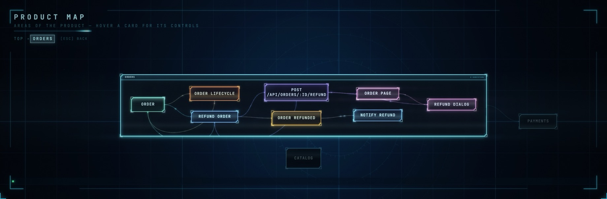

<div align="center">

# GitMir Local

### Open-source Object Context for AI software development.

[](LICENSE)
[](#local-and-what-that-does-and-does-not-mean)
[](#local-and-what-that-does-and-does-not-mean)
[](#local-and-what-that-does-and-does-not-mean)
[](SECURITY.md)
[](docs/MCP.md)

</div>

Your repository holds the code. Nobody holds **how the product actually works** — it lives
in several heads, in a wiki that stopped being true, and in whoever wrote it. So every task
starts by reconstructing it, and the agent reconstructs it wrong.

GitMir answers that question instead of re-deriving it. The answering happens in the
laboratory; this is the tool you run next to your code.

```
                 YOUR REPOSITORY
                        │
                        ▼
          ┌───────────────────────────┐
          │      THE LABORATORY       │   what the product does, and
          │      lab.gitmir.com       │   what a change would reach
          └───────────────────────────┘
                        │  MCP
             ┌──────────┴──────────┐
             ▼                     ▼
       GITMIR LOCAL            YOUR AGENT
     the queue, the audits,   the slice this task
     the findings, the board  needs, and nothing else
```

**This tool works with no account for everything that does not need a model**: the task
queue, the findings, the audits that walk a running application, the board. Connect a
laboratory and the same screens start answering the questions a queue cannot — what a task
would actually reach, and how that compares to what its ticket admits.

**Zero runtime dependencies · no telemetry · MCP included**

[60 seconds](#60-seconds) · [Five minutes on your own repository](#five-minutes-on-your-own-repository) · [The MCP server](docs/MCP.md)

---

## One change, two readings

A ticket says **"Allow a partial refund."**

What the repository shows you: a refund function, an endpoint, a dialog.

What the product says that change means:

```
Allow a partial refund
├── refundOrder                    the function named on the ticket
├── Order                          its lifecycle has a refunded state, with effects
├── OrderRefunded                  an event two other functions handle
├── Payment                        money — marked sensitive in the model
├── captureRefund                  runs downstream, in another area
├── notifyRefund                   runs downstream
├── POST /api/orders/:id/refund
├── OrderPage · RefundDialog
└── "Refund an order"              a journey a person walks, 5 steps
```

**Two areas. One journey. One lifecycle. Money in reach.**
Nine of the parts this product is made of, across two of its areas.

> The ticket tells the agent what to change.
> GitMir shows what the product says that change **means**.

A developer can implement the ticket exactly as written and still implement the wrong
change for the product. So can an agent, faster.

**→ [the laboratory](https://lab.gitmir.com)** — where that second reading is worked
out, what it is confident about, and how to disagree with it.

---

## Every answer leaves a line you can read

Open a project and the first screen is not a settings form. It is what needs a
person, what has been caught, and what has been asked.

Every answer the MCP server serves leaves one line in `.gitmir/usage.jsonl`: when,
which tool, what was asked, and how many bytes went back. Plain text, on your disk,
appended and never sent.

That file is the point. "No telemetry" is a claim anybody can make; a log of every
answer, on your own machine, is a claim you can check.

---

## How much of a change was first-pass work

A request rarely lands in one pass. It lands, somebody says *that is not what I
meant*, and the rest is a person walking the agent to the finish. Those two halves
cost differently, and are almost always reported as one number: "the feature took
four days".

The **Audit** tab separates them, from nothing but the moves your tasks make
between `todo → in progress → verify → done`:

```
€854   What 4 changes cost over 7 days, at €85/h.
       €623 of it — 73% — went on rework.

  ██████████░░░░░░░░░░░░░░░░░░░░░░░░░░░░░░░░░░░░░░
  ■ First pass  2.7h · €231      ■ Rework  7.3h · €623

FIRST-PASS RATIO       50%      ITERATIONS PER CHANGE  1.0
REVIEW CYCLES            8      LATE DISCOVERIES         2

WHERE THE TIME CONCENTRATES
  Search           4.8h after first pass · 2 changes
  Billing rules    2.3h after first pass · 1 change
```

<sub>A worked example of the screen, not a reading of any project shipped here:
<code>examples/refund-shop</code> has queued tasks but no history of moving them, and the
tab says <em>not enough data</em> rather than inventing a number. Run it on a queue you
have actually worked and the figures are yours.</sub>

Every change carries **two prices** — the cyan half is the work, the red half is
the cost of it not being right yet — and the same bar sits on each task card in the
queue, so you can see per request what came back and what that cost. Give it an
hourly rate and it reads in money; leave it out and it reads in hours.

Every number opens to show what it was computed from, and the screen states the
rules it applied rather than assuming you trust them: which changes were in the
sample, and how many stretches the idle cutoff refused to count — because a queue
move cannot tell a night from six hours of unbroken work, and pretending otherwise
would be the easiest place in this product to lie.

Below four changes it says *not enough data* in words instead of showing a
confident `0%`.

**It cuts by part of the product, never by person.** There is no per-person number
in the screen, the API, the export, or `.gitmir/audit/events.jsonl` — which
carries no name, no email and no machine. That is not a default; it is the design.
The per-task and per-object cuts work from the queue alone; grouping those objects
into areas is the one part that needs a laboratory, because that is where the
areas are known.

**→ [Every definition, and what each one refuses to claim](docs/CHANGE-AUDIT.md)**

## What you get

**1 · Understand the product.** Ask what checkout depends on, where a business rule is
implemented, why an order can enter a state — answered by walking the model rather than
reassembling it from files.

**2 · Understand a change.** What it reaches, in both directions. Inbound is the direction
that gets forgotten: what the function calls is already in your head, what calls *it* is
not.

**3 · Give the agent the right context.** Not more context — the *relevant* context. The
slice for this change, over MCP, with the rules it must not break and the deviations
already known in the code it is about to touch.

**4 · Verify the outcome.** The affected context becomes the verification steps. A task is
not done because code was generated; it is done when the expected product behaviour is
proven.

> **Understand → Execute → Verify**, over one shared reading of the product.

---

## 60 seconds

Read it first, then run it:

```bash
git clone https://github.com/gitmir-hello/gitmir-local.git
cd gitmir-local
node server.ts
```

Or install the `gitmir` command:

```bash
curl -fsSL https://ide.gitmir.com/install.sh | sh     # macOS · Linux
irm https://ide.gitmir.com/install.ps1 | iex          # Windows
gitmir
```

<sub>Clones into <code>~/.gitmir/local</code>, links one command onto your PATH, and pulls nothing from a package registry. <a href="install.sh">Read the installer</a> — it is short on purpose. There is no npm route: <code>npm i -g</code> would put this under <code>node_modules</code>, where Node refuses to strip TypeScript types.</sub>

**http://localhost:4599** → add a project folder. The queue, the findings and the
audits work immediately; the screens that describe the product ask you to connect a
laboratory, because that is where the answering happens.

Reading a repository and working out what it does is the expensive part, and it is done
once, in the laboratory, rather than on every machine that wants an answer. What comes back
here is answers — never a copy of the product to keep in step.

| Command | |
|---|---|
| `gitmir` | start it and open the browser |
| `gitmir mcp add` | register the MCP server with the Claude Code CLI |
| `gitmir status` | Node version, port, what is missing |
| `gitmir update` | pull the latest, and restart if it was running |

Want to look before pointing it at your own code? Add
[`examples/refund-shop`](examples/refund-shop) — an invented shop with three tasks, two
of them still planned.

---

## Five minutes on your own repository

Connect a laboratory — sign in at [lab.gitmir.com](https://lab.gitmir.com), copy the key
from your account and export it as `GITMIR_LAB_KEY` — then ask your agent these five
questions:

1. What are the main business objects in this product?
2. Pick one that matters. What depends on it — in both directions?
3. Where is its lifecycle implemented, and what fires on each transition?
4. If I change that behaviour, which user journeys could be affected?
5. Which of the relationships in your answer are **inferred** rather than confirmed?

If any answer surprises you, GitMir has surfaced context that was living in the repository
or in somebody's head.

---

## What stays in your repository, instead of another chat history

```
.gitmir/findings/    where the code does not do what the product says
tasks/               work, its declared scope, its approval, its history
```

That is all of it, and it is all plain text you can read, edit and commit. A task names
the parts of the product it will touch by their **handles** — opaque labels issued by the
laboratory. A handle points at something and says nothing else: not its kind, not its
neighbours, not where it sits. Which is why the queue can live in a public repository
while what it refers to does not.

What the laboratory adds is the other half of the sentence: what those handles are, what
depends on them, and how far this change would really reach. That is the part nobody has
without reading the whole product — and reading the whole product on every task is exactly
what this exists to stop.

This is not "the code is the truth". The code is one input, alongside confirmed rules,
decisions and evidence — which is why `spec-audit` can record where they disagree instead
of quietly preferring one.

---

## Use it from the agent you already have

```bash
gitmir mcp add
```

Then ask, in Claude Code, Cursor, or anything else that speaks
[MCP](https://modelcontextprotocol.io):

```
What needs a person in this project right now?
What is planned, and what has actually been approved to run?
Where is the code already known not to do what the spec says?
Record that this one is accepted, and by whom.
Turn that finding into a task with checks that prove it.
```

Your editor starts it as a subprocess over stdin/stdout — **no port, nothing uploaded,
and the dashboard does not need to be running.** It answers from `.gitmir/` and `tasks/`
and opens no source file.

The other half — what the product does, what depends on what, how far a change would
reach — is the laboratory's own MCP endpoint, registered alongside this one.

**→ [The MCP server](docs/MCP.md)** — eleven tools, and what each admits about its own
behaviour.

An agent that starts a session with `gitmir_attention` gets the list this screen shows —
what is unverified, what was queued without approval, what has stalled — with the
procedure that closes each one. The system does the noticing; a person still does the
deciding, which is the only version of "it runs itself" a governance tool can defend.

---

## Trust is visible

The first question after "an AI built a model of my product" is *what if it got it wrong* —
so the answer is on screen rather than in a footnote.

**An AI reads and structures the codebase. Once the relationships are written down, GitMir
walks them deterministically** — the same model gives the same answer every time, and
changing one link by hand moves the number accordingly. What you are asked to trust is the
map, not the arithmetic. And the map states its own standing:

- **Freshness** — how far the code has moved since the model was built, on every answer
- **Declared or inferred** — whether a task named its scope, or the numbers came from what
  it merely mentions
- **Known deviations** — where the code does not do what the spec says, marked on the
  objects themselves
- **Gaps** — what the model does not know about your product yet, stated as absence rather
  than left silent

The **How much to trust it** view exists to be read before quoting any number from any
other view.

---

## Start with the problem you have

| Your situation | The path |
|---|---|
| I inherited a codebase | `legacy-maintenance` |
| I need to make a risky change | `task-planner` → `task-runner` |
| The docs and the code may disagree | `spec-audit` |
| I have to prove the app actually works | `app-audit` |
| I am moving this to another stack | `stack-port` |
| I am changing an old system I did not write | `legacy-maintenance` |
| I have an idea and no spec | `product-docs-spec` → `task-planner` |
| I cannot say what was done last week | `task-log` |

Eight skills, plain markdown in [`skills/`](skills) — read them, change them, keep your
own. They are served as MCP prompts too, so most clients surface them as slash commands.

The procedures that build and walk the model are not here. They are what the laboratory
does, and they are the part of this product that is not open — see
[LICENSING.md](LICENSING.md).

**→ [What each one does](docs/SKILLS.md)**

---

## Drawing what it should become

The map is not only a picture of what exists: an element can be declared before it is
built, and it is drawn beside the real thing in a colour that says so. Turning a
declaration into tasks writes the checks from what was declared, so a task cannot be
called done because code appeared — the behaviour has to be there afterwards.

That screen draws from the laboratory, and it is being reconnected to it. Until then it
says so rather than showing an empty frame.


## Where the code disagrees with the product

Your agent reads the spec against the code and finds fifteen places they disagree. It
writes them in a reply, and they are gone when the conversation ends — the agent that edits
one of those functions next week does not know, and neither does whoever approves the
change.

`spec-audit` records them instead. Each names the rule, what the code does instead, what
that costs, and the objects it sits on:

- the object is **drawn as deviating on every diagram** — in colour, so the mark survives
  at the zoom where labels disappear
- the **change radius warns** before anyone approves work that reaches it
- the **context handed to an agent carries it**, so it cannot plan against rules the code
  does not follow
- deciding to **live with one records who decided and why** — the difference between a
  product with known limits and one with surprises

A finding remembers the files it was read from. When one changes, it asks to be re-checked
rather than going on asserting something about code that has moved.

---

## The dashboard

Arranged by the question you arrived with, not by the shape of the data. Every view opens
by saying what it is, what it gives you, and how to use it.

| The question | What answers it |
|---|---|
| **What does it do?** | the product map, the journeys people walk, the business objects, where data moves between areas, what raises a signal |
| **Why does it work this way?** | the lifecycle of each object, and every branch with the condition it actually checks |
| **What would a change cost?** | what a task reaches, how much of the product that is, whether anything sensitive is in it |
| **Who answers for it?** | the owning team per area — and the areas nobody has claimed, drawn as the gap they are |
| **How much should I trust it?** | where the model is solid, where it is guessing, what it does not know |
| **What actually happened?** | where the code disagrees with the spec, what changed between two dates, whether finished work stayed inside its declared scope |

Every diagram opens: an area holds its objects, a transition holds what it fires — so the
top level stays a size you can take in and the detail is one click inside it.



Alongside: **Queue** (`todo → in progress → verify → done`, each card carrying its risk and
its approval) and **Preview** (open any URL, click an element, get a prompt naming it and
the files it probably lives in).

They are drawn on a canvas by a renderer written for this project — which is why `vendor/`
holds nothing but the fonts and the GITMIR marks, and no diagram library at all.

---

## Local, and what that does and does not mean

**Your source code never leaves this machine.** The dashboard, the MCP server, the queue,
the findings and the change audit run here and are stored in your project. There is no
GitMir telemetry — not reduced, not anonymised, none — and no account is required for any
of that. Set `GITMIR_LAB_KEY` and one more thing happens: questions about your product go
to the laboratory and answers come back. Your code is in neither direction, on any path.
([SECURITY.md](SECURITY.md))

**Your coding agent is a separate program with its own policy.** Claude Code, Cursor or
whatever you run sends code and context to the model provider it is configured against,
under that provider's data terms. GitMir does not change that and will not pretend to. What
it changes is *how much* has to be sent: the relevant slice of the model, instead of the
repository, over and over.

**Requirements.** [Node.js](https://nodejs.org) 22.18+ — it runs the TypeScript directly, so
`node server.ts` is the whole build system. The `claude` CLI on your PATH if you want the
dashboard to run Claude for you. macOS · Windows · Linux. `dependencies` is empty and
staying that way: the renderer is written for this and the fonts are vendored, so there is
nothing to fetch at install time or at run time. Port 4599, or `GITMIR_PORT=4600`.

---

## Local → Connect → Team → Enterprise

**GitMir Local** — this repository. Free, open source, and not a trial: every view, the
MCP server, eight skills, the task queue with risk and approval, the findings, and the
change audit. One person on one machine, for as long as they like.

The paid part begins at the second person — a shared model between machines, tasks that
travel between teammates, their snapshots next to yours — and continues into adapting
GitMir to an organisation's own products, agents and rules.
**→ [ide.gitmir.com](https://ide.gitmir.com)**

Your source code never leaves your machine either way. What travels between teammates is
the task queue — each task's title, body, status, order and acceptance criteria — and
nothing else. The relay routes messages and stores no business logic, which is why this
client is open in the first place: you can read exactly what it sends.

**License.** Dual: **[AGPL-3.0](LICENSE)** — fork it, use it for paid work, run it forever
without us; distribute a modified version as a service and your source goes AGPL too. Or a
**[commercial license](LICENSING.md)** for closed-source embedding — **hello@gitmir.com**.

---

<div align="center">

We built this for ourselves — we run Claude Code all day across dozens of projects.

**Run it on a product you actually know, then tell us:**
did the model understand it correctly · what did it miss · what dependency did it find that
you did not expect

**[Share what the model got right and wrong](https://github.com/gitmir-hello/gitmir-local/discussions/1)**
There is no telemetry, so that thread is the only way we learn anything.

🌐 **[gitmir.com](https://gitmir.com)** · 🚀 **[ide.gitmir.com](https://ide.gitmir.com)** · ✉️ **hello@gitmir.com**

<sub>© GITMIR · bundled fonts ship under their own licenses ([THIRD_PARTY.md](THIRD_PARTY.md)) · the GITMIR name and logo are trademarks</sub>

</div>
